# Market Oracle v2 - Project Phases Document

> **Complete execution plan for SDE + ML internship-ready project**  
> Total Duration: **30 Days** (~2-3 hrs/day)  
> Target: SDE & ML Internship Portfolio

---

## 📊 Project Architecture Overview

```mermaid
flowchart TB
    subgraph DATA["📁 Data Layer"]
        A[("Yahoo Finance API")] --> B["data_loader.py"]
        C[("NewsAPI")] --> D["sentiment.py"]
    end
    
    subgraph FEATURES["⚙️ Feature Engineering"]
        B --> E["indicators.py"]
        E --> F["Technical Features<br>(RSI, MACD, SMA, Vol)"]
        D --> G["Sentiment Features<br>(VADER Scores)"]
    end
    
    subgraph MODELS["🧠 ML Models"]
        F --> H["Phase 1:<br>Logistic Reg + RF"]
        F --> I["Phase 2:<br>LSTM Model"]
        F & G --> J["Phase 3:<br>LSTM + Attention<br>+ Sentiment"]
    end
    
    subgraph EVAL["📈 Evaluation"]
        H & I & J --> K["walk_forward.py"]
        K --> L["backtester.py"]
        L --> M["Performance Metrics<br>(Sharpe, CAGR, DD)"]
    end
    
    subgraph PROD["🚀 Production"]
        M --> N["MLflow Tracking"]
        N --> O["pytest + CI/CD"]
        O --> P["Docker Container"]
    end
```



---

## 🗓️ Phase Summary Table

| Phase | Focus | Duration | Key Deliverables |
|-------|-------|----------|------------------|
| **Phase 1** | ML Foundations + Classifier | 7 days | Feature pipeline, LR/RF classifier, walk-forward, **tests** |
| **Phase 2** | Deep Learning + LSTM | 7 days | LSTM model, windowing, direction prediction, **type hints** |
| **Phase 3** | NLP + Sentiment + Attention | 8 days | Sentiment, attention, multi-input, **ablation studies** |
| **Phase 4** | Backtesting + Production | 8 days | Trading engine, **MLflow, CI/CD, Docker**, report |

---

## 🎯 Target Ratings

| Role | Before | After 30 Days |
|------|--------|---------------|
| SDE Internship | 8/10 | **9.5/10** |
| ML Internship | 7.5/10 | **9/10** |

---

# � Learning Resources by Day

> **How to use:** Before starting each day's work, spend 20-30 minutes watching/reading the linked resources. Then implement what you learned.

## Phase 1 Resources (Days 1-7)

| Day | Topic | Resources (Watch/Read First) |
|-----|-------|------------------------------|
| **1** | Project Setup, yfinance | • [yfinance docs](https://pypi.org/project/yfinance/) (5 min read)<br>• [Python Project Structure](https://youtu.be/ia19n_yK4Qs) - ArjanCodes (12 min) |
| **2** | pandas, pytest basics | • [Corey Schafer - pandas](https://youtu.be/ZyhVh-qRZPA) (1 hr playlist, watch first 3)<br>• [pytest in 5 minutes](https://youtu.be/etosV2IWBF0) - PyTest basics |
| **3** | Technical Indicators | • [RSI Explained](https://youtu.be/oLXTl_Sw2O0) (8 min)<br>• [MACD Explained](https://youtu.be/eob4wv2v--k) (10 min)<br>• [ta-lib Python docs](https://technical-analysis-library-in-python.readthedocs.io/) |
| **4** | pytest advanced | • [pytest Full Tutorial](https://youtu.be/YbpKMIUjvK8) - Tech With Tim (45 min) |
| **5** | Walk-Forward Validation | • [Walk Forward Validation](https://machinelearningmastery.com/backtest-machine-learning-models-time-series-forecasting/) - MLMastery article<br>• [Time Series CV](https://youtu.be/Lwpoy11Ga2g) (15 min) |
| **6** | Logistic Reg, Random Forest | • [StatQuest - Logistic Regression](https://youtu.be/yIYKR4sgzI8) (9 min)<br>• [StatQuest - Random Forest](https://youtu.be/J4Wdy0Wc_xQ) (10 min)<br>• [scikit-learn docs](https://scikit-learn.org/stable/modules/ensemble.html) |
| **7** | Documentation | • [Write Good README](https://youtu.be/E6NO0rgFub4) - Traversy (8 min) |

## Phase 2 Resources (Days 8-14)

| Day | Topic | Resources |
|-----|-------|-----------|
| **8** | Time Series Windowing | • [Sliding Window for ML](https://machinelearningmastery.com/time-series-forecasting-supervised-learning/) - MLMastery |
| **9** | Advanced pytest | • [pytest fixtures & mocking](https://youtu.be/YVRx_6nQPBg) - Socratica (20 min) |
| **10** | LSTM Theory | • [StatQuest - RNN](https://youtu.be/AsNTP8Kwu80) (15 min)<br>• [StatQuest - LSTM](https://youtu.be/YCzL96nL7j0) (13 min) **← Must watch!**<br>• [Colah's LSTM Blog](https://colah.github.io/posts/2015-08-Understanding-LSTMs/) **← Best written guide** |
| **11** | Python Logging | • [Corey Schafer - Logging](https://youtu.be/-ARI4Cz-awo) (15 min)<br>• [Type Hints](https://youtu.be/QORvB-_mbZ0) - ArjanCodes (15 min) |
| **12** | TensorFlow/Keras LSTM | • [TensorFlow LSTM Tutorial](https://www.tensorflow.org/tutorials/structured_data/time_series)<br>• [Keras Sequential API](https://youtu.be/WvoLTXIjBYU) - Sentdex (20 min) |
| **13** | Model Evaluation | • [Learning Curves](https://scikit-learn.org/stable/auto_examples/model_selection/plot_learning_curve.html) - sklearn docs |
| **14** | mypy Type Checking | • [mypy Tutorial](https://youtu.be/lle1x1kqIu0) - ArjanCodes (18 min) |

## Phase 3 Resources (Days 15-22)

| Day | Topic | Resources |
|-----|-------|-----------|
| **15-16** | Sentiment Analysis | • [VADER Sentiment](https://youtu.be/xvqsFTUsOmc) - NLP (15 min)<br>• [NewsAPI docs](https://newsapi.org/docs)<br>• [NLTK VADER guide](https://www.nltk.org/howto/sentiment.html) |
| **17** | Attention Mechanism | • [Attention in 10 min](https://youtu.be/fjJOgb-E41w) - Rasa<br>• [Attention Explained](https://jalammar.github.io/visualizing-neural-machine-translation-mechanics-of-seq2seq-models-with-attention/) - Jay Alammar blog **← Best visual guide** |
| **18** | Keras Functional API | • [Keras Functional API](https://youtu.be/EvGS3VAsG4Y) - Sentdex (15 min)<br>• [Multi-Input Models](https://keras.io/guides/functional_api/) - Keras docs |
| **19** | MLflow | • [MLflow in 15 min](https://youtu.be/x3cxvsUFVZA) - MLflow official<br>• [MLflow Quickstart](https://mlflow.org/docs/latest/quickstart.html) |
| **20** | Ablation Studies | • [What is Ablation Study?](https://towardsdatascience.com/what-is-ablation-study-in-machine-learning-5f3f4d0c0) - TDS article<br>• [Statistical Significance](https://youtu.be/5koKb5B_YWo) - StatQuest t-test (12 min) |
| **21** | Generalization | • [Overfitting & Regularization](https://youtu.be/Q81RR3yKn30) - StatQuest (9 min) |
| **22** | Documentation | • Review resources, consolidate notes |

## Phase 4 Resources (Days 23-30)

| Day | Topic | Resources |
|-----|-------|-----------|
| **23-24** | Backtesting | • [Backtesting 101](https://youtu.be/vC7IJXz-s4E) - QuantInsti (30 min)<br>• [Sharpe Ratio](https://youtu.be/kx3b8d-P4YY) (8 min)<br>• [Drawdown Calculation](https://www.investopedia.com/terms/m/maximum-drawdown-mdd.asp) |
| **25** | CLI (argparse/click) | • [argparse Tutorial](https://youtu.be/cdblJqEUDNo) - Corey Schafer (15 min)<br>• [click library](https://youtu.be/kNke39OZ2k0) (12 min) |
| **26** | GitHub Actions CI/CD | • [GitHub Actions in 10 min](https://youtu.be/R8_veQiYBjI) - Fireship<br>• [Python CI Tutorial](https://youtu.be/mFFXuXjVgkU) - TechWorld (20 min) |
| **27** | Docker | • [Docker in 100 Seconds](https://youtu.be/Gjnup-PuquQ) - Fireship<br>• [Docker for Python](https://youtu.be/0TFWtfFY87U) - Patrick Loeber (25 min)<br>• [Dockerfile best practices](https://docs.docker.com/develop/develop-images/dockerfile_best-practices/) |
| **28** | Data Visualization | • [Matplotlib Tips](https://youtu.be/UO98lJQ3QGI) - Corey Schafer<br>• [Seaborn Tutorial](https://youtu.be/6GUZXDef2U0) (40 min) |
| **29** | Technical Writing | • [How to Write Report](https://youtu.be/L7YQGbG8me4) - Academic reports |
| **30** | Final Polish | • [README Badges](https://shields.io/)<br>• [pre-commit hooks](https://pre-commit.com/) docs |

---

## 🎥 Binge-Watch Playlists (Optional)

If you prefer watching everything upfront, these playlists cover most topics:

| Playlist | Duration | Covers Days |
|----------|----------|-------------|
| [StatQuest ML Fundamentals](https://youtube.com/playlist?list=PLblh5JKOoLUICTaGLRoHQDuF_7q2GfuJF) | ~4 hrs | 5, 6, 10, 20 |
| [Corey Schafer - pandas](https://youtube.com/playlist?list=PL-osiE80TeTsWmV9i9c58mdDCSskIFdDS) | ~2 hrs | 1, 2, 3 |
| [TensorFlow/Keras Basics](https://youtube.com/playlist?list=PLQVvvaa0QuDfhTox0AjmQ6tvTgMBZBEXN) | ~3 hrs | 10, 12, 18 |
| [ArjanCodes - Python Best Practices](https://youtube.com/@ArjanCodes) | Watch top videos | 1, 11, 14, 25 |

---

## 📖 Quick Reference Docs (Bookmark These)

| Library | Documentation |
|---------|---------------|
| pandas | [pandas.pydata.org](https://pandas.pydata.org/docs/) |
| scikit-learn | [scikit-learn.org](https://scikit-learn.org/stable/) |
| TensorFlow/Keras | [tensorflow.org](https://www.tensorflow.org/tutorials) |
| pytest | [docs.pytest.org](https://docs.pytest.org/) |
| MLflow | [mlflow.org/docs](https://mlflow.org/docs/latest/index.html) |
| yfinance | [pypi.org/project/yfinance](https://pypi.org/project/yfinance/) |

---

# �🟦 PHASE 1: ML Foundations + Classifier
**Duration:** 7 Days (~2-3 hrs/day)

## Goal
Build a production-ready feature engineering pipeline with proper testing and train baseline classifiers.

## Deliverables Checklist

### Day 1: Project Setup & Data Infrastructure
- [ ] Initialize project structure:
  ```
  Market-Oracle/
  ├── data/raw/
  ├── data/processed/
  ├── models/
  ├── notebooks/
  ├── tests/
  ├── config/
  └── outputs/
  ```
- [ ] Create `requirements.txt` with pinned versions
- [ ] Create `config/config.yaml` for all parameters
- [ ] **`data_loader.py`** - Stock data fetching
  - [ ] Download ticker data via yfinance
  - [ ] Type hints on all functions

### Day 2: Data Cleaning & Log Returns
- [ ] **`data_loader.py`** continued
  - [ ] Handle missing values (forward-fill, drop)
  - [ ] Compute log returns: `log_return = np.log(close/close.shift(1))`
  - [ ] Save to `/data/raw/{ticker}.csv`
  - [ ] Add date filtering & multi-ticker support
- [ ] **`tests/test_data_loader.py`** 🧪
  - [ ] Test NA handling
  - [ ] Test log return calculation
  - [ ] Test edge cases (empty data, single row)

### Day 3: Technical Indicators
- [ ] **`indicators.py`** - Technical indicators module
  - [ ] RSI (14-period default)
  - [ ] MACD (12, 26, 9)
  - [ ] SMA 50 & SMA 200 + crossover signal
  - [ ] Rolling volatility (20-day std)
  - [ ] Type hints on all functions
- [ ] Save processed features to `/data/processed/`

### Day 4: Indicators Testing & Validation
- [ ] **`tests/test_indicators.py`** 🧪
  - [ ] Test RSI bounds (0-100)
  - [ ] Test SMA calculation manually
  - [ ] Test edge cases (insufficient data)
- [ ] Validate indicators match external sources (TradingView)

### Day 5: Walk-Forward Validation
- [ ] **`walk_forward.py`** - Time-series validation
  - [ ] Implement expanding window splitter
  - [ ] Minimum training window parameter
  - [ ] Step size configuration
  - [ ] Return train/test indices generator
  - [ ] Type hints
- [ ] **`tests/test_walk_forward.py`** 🧪
  - [ ] Test no data leakage
  - [ ] Test fold sizes correct

### Day 6: Phase 1 Models Training
- [ ] **`notebooks/01_phase1_classifier.ipynb`**
  - [ ] Train Logistic Regression classifier
  - [ ] Train Random Forest classifier
  - [ ] Generate classification report (precision, recall, F1)
  - [ ] Plot feature importance (RF)
  - [ ] Compare models across walk-forward folds
  - [ ] **Naive baseline: always predict "up"** 📊
  - [ ] Save best model to `/models/phase1/`

### Day 7: Documentation & Review
- [ ] Clean all code with docstrings
- [ ] Run all tests: `pytest tests/ -v`
- [ ] Update README with Phase 1 section
- [ ] Push to GitHub with proper commit messages

---

## Phase 1 Pipeline Diagram


---

# 🟦 PHASE 2: Deep Learning + LSTM
**Duration:** 7 Days (~2-3 hrs/day)

## Goal
Build an LSTM model with proper type hints, testing, and logging infrastructure.

## Deliverables Checklist

### Day 8: Windowing Pipeline
- [ ] **`windowing.py`** - Time-series windowing utility
  - [ ] `create_windows(data, window_size=30)` function
  - [ ] Output shape: `X: (samples, window, features)`, `y: (samples,)`
  - [ ] Type hints with numpy typing
- [ ] Read window_size from `config/config.yaml`

### Day 9: Windowing Testing & Scaling
- [ ] **`tests/test_windowing.py`** 🧪
  - [ ] Test output shapes correct
  - [ ] Test no data leakage in scaling
  - [ ] Test edge cases
- [ ] **`windowing.py`** continued
  - [ ] Handle feature scaling (MinMax or Standard)
  - [ ] Prevent data leakage in scaling (fit on train only)

### Day 10: LSTM Architecture
- [ ] **`models/lstm_model.py`**
  - [ ] Define LSTM architecture:
    ```python
    LSTM(64, return_sequences=False)
    Dropout(0.2)
    Dense(32, activation='relu')
    Dense(1)  # Regression output
    ```
  - [ ] Loss: MSE, Optimizer: Adam
  - [ ] Early stopping callback
  - [ ] Type hints throughout

### Day 11: Model Utilities & Logging
- [ ] **`models/lstm_model.py`** continued
  - [ ] Model save/load utilities
  - [ ] Proper logging (not print statements)
- [ ] Set up **logging** module in `utils/logger.py`
  - [ ] File + console handlers
  - [ ] Configurable log levels

### Day 12: Training Pipeline
- [ ] **`notebooks/02_lstm_training.ipynb`**
  - [ ] Integrate walk-forward with LSTM
  - [ ] Train across multiple folds
  - [ ] Track metrics per fold:
    - [ ] RMSE, MAE
    - [ ] Direction accuracy (sign match %)
  - [ ] Save best weights per fold

### Day 13: Evaluation & Visualization
- [ ] **Visualization outputs:**
  - [ ] Predicted vs Actual returns scatter plot
  - [ ] Time-series overlay (pred vs actual)
  - [ ] Loss curves per fold
  - [ ] Direction accuracy comparison bar chart
  - [ ] **Learning curves** (train vs val loss)
- [ ] **Compare vs Phase 1 models** (LR, RF)

### Day 14: Documentation & Code Quality
- [ ] Run `mypy` for type checking
- [ ] Code cleanup and docstrings
- [ ] Run all tests: `pytest tests/ -v`
- [ ] Update README Phase 2 section
- [ ] Push to GitHub

---

## Phase 2 Architecture


---

# 🟦 PHASE 3: NLP + Sentiment + Attention
**Duration:** 8 Days (~2-3 hrs/day)

## Goal
Integrate sentiment analysis, implement attention mechanism, and conduct proper ablation studies.

## Deliverables Checklist

### Day 15: Sentiment Pipeline Setup
- [ ] **`sentiment.py`** - News sentiment module
  - [ ] NewsAPI integration (or GDELT/FinViz)
  - [ ] VADER sentiment scoring
  - [ ] Type hints
- [ ] Handle API rate limits gracefully

### Day 16: Sentiment Aggregation
- [ ] **`sentiment.py`** continued
  - [ ] Daily sentiment aggregation:
    - [ ] Mean compound score
    - [ ] Sentiment volatility
    - [ ] News volume
  - [ ] Merge with price data (use t for predicting t+1)
  - [ ] Save to `/data/processed/sentiment/`
- [ ] **`tests/test_sentiment.py`** 🧪

### Day 17: Attention Mechanism
- [ ] **`models/attention.py`** - Custom Keras layer
  ```python
  class AttentionLayer(tf.keras.layers.Layer):
      # score = tanh(W @ h + b)
      # weights = softmax(score)
      # context = sum(weights * h)
  ```
- [ ] Attention weights extraction method
- [ ] Type hints

### Day 18: Multi-Input Model
- [ ] **`models/attention_lstm.py`**
  - [ ] Dual input architecture:
    - [ ] Price features → LSTM → Attention
    - [ ] Sentiment features → Dense
    - [ ] Concatenate → Output
  - [ ] Functional API implementation
- [ ] **`tests/test_models.py`** 🧪

### Day 19: Experiment Tracking Setup
- [ ] Set up **MLflow** (or Weights & Biases)
  - [ ] Log all hyperparameters
  - [ ] Log metrics per fold
  - [ ] Log model artifacts
- [ ] Create `mlflow_utils.py` helper

### Day 20: Ablation Studies 📊
- [ ] **`notebooks/03_ablation_study.ipynb`**
  - [ ] Ablation study table:
    | Model Variant | Dir Acc | RMSE | Δ vs Base |
    |---------------|---------|------|-----------|
    | Naive (always up) | X% | - | baseline |
    | Logistic Reg | X% | X | +X% |
    | Random Forest | X% | X | +X% |
    | LSTM only | X% | X | +X% |
    | LSTM + Attention | X% | X | +X% |
    | LSTM + Sentiment | X% | X | +X% |
    | Full model | X% | X | +X% |
  - [ ] Statistical significance (t-test)

### Day 21: Multi-Ticker Validation
- [ ] Test on 5 diverse tickers:
  - [ ] AAPL (Tech)
  - [ ] JPM (Finance)
  - [ ] XOM (Energy)
  - [ ] AMZN (Consumer)
  - [ ] MSFT (Tech)
- [ ] Create generalization table
- [ ] Identify failure cases

### Day 22: Phase 3 Documentation
- [ ] Generate attention heatmaps
- [ ] Document sentiment impact analysis
- [ ] Update README Phase 3 section
- [ ] All tests passing: `pytest tests/ -v`
- [ ] Push to GitHub

---

## Phase 3 Multi-Input Architecture


---

# 🟦 PHASE 4: Backtesting + Production
**Duration:** 8 Days (~2-3 hrs/day)

## Goal
Build trading simulation, production infrastructure (CI/CD, Docker), and finalize deliverables.

## Deliverables Checklist

### Day 23: Backtesting Engine
- [ ] **`backtester.py`** - Trading simulation
  - [ ] Strategy logic:
    ```python
    if predicted_return > threshold:
        position = 1  # BUY
    else:
        position = 0  # CASH
    ```
  - [ ] **Transaction costs: 10bps per trade** (mandatory)
  - [ ] Equity curve generation
  - [ ] Type hints

### Day 24: Performance Metrics
- [ ] **`backtester.py`** continued
  - [ ] Performance metrics:
    - [ ] CAGR
    - [ ] Sharpe Ratio
    - [ ] Max Drawdown
    - [ ] Win Rate
    - [ ] Profit Factor
- [ ] **`tests/test_backtester.py`** 🧪
- [ ] Compare vs buy-and-hold baseline

### Day 25: Full Pipeline Integration
- [ ] **`main.py`** - End-to-end pipeline
  ```python
  # 1. Load raw data
  # 2. Compute indicators
  # 3. Add sentiment
  # 4. Create windows
  # 5. Run model predictions
  # 6. Backtest strategy
  # 7. Generate report
  ```
- [ ] CLI with argparse/click
- [ ] Config file support (YAML)

### Day 26: CI/CD Pipeline
- [ ] **`.github/workflows/ci.yml`**
  ```yaml
  on: [push, pull_request]
  jobs:
    test:
      runs-on: ubuntu-latest
      steps:
        - uses: actions/checkout@v3
        - name: Install deps
          run: pip install -r requirements.txt
        - name: Run tests
          run: pytest tests/ -v
        - name: Type check
          run: mypy src/
  ```
- [ ] Add pytest-cov for coverage reporting
- [ ] Add badge to README

### Day 27: Docker Container
- [ ] **`Dockerfile`**
  ```dockerfile
  FROM python:3.10-slim
  WORKDIR /app
  COPY requirements.txt .
  RUN pip install -r requirements.txt
  COPY . .
  CMD ["python", "main.py"]
  ```
- [ ] **`docker-compose.yml`** (optional)
- [ ] Test container locally
- [ ] Add Docker instructions to README

### Day 28: Visualization Suite
- [ ] **`visualization.py`** - Chart generation
  - [ ] Equity curve vs buy-and-hold
  - [ ] Daily returns distribution
  - [ ] Drawdown chart
  - [ ] Attention heatmap
  - [ ] Feature importance
  - [ ] Model comparison radar chart
  - [ ] Confusion matrix + ROC curve
- [ ] Save all plots to `/outputs/figures/`

### Day 29: Final Report
- [ ] **`docs/final_report.md`**
  1. [ ] Abstract (150 words)
  2. [ ] Problem Statement
  3. [ ] Data Sources & Preprocessing
  4. [ ] Methodology (walk-forward, no leakage)
  5. [ ] Model Architectures (with diagrams)
  6. [ ] **Ablation Study Results**
  7. [ ] **Statistical Significance**
  8. [ ] Backtest Performance (with transaction costs)
  9. [ ] **Multi-Ticker Generalization**
  10. [ ] Limitations & Assumptions
  11. [ ] Future Work
  12. [ ] References

### Day 30: GitHub Polish & Final Review
- [ ] **Professional README** with:
  - [ ] Project banner/logo
  - [ ] Architecture diagram (Mermaid)
  - [ ] Results summary table
  - [ ] **CI/CD badge** ✅
  - [ ] **Coverage badge** 📊
  - [ ] Installation: `pip install -r requirements.txt`
  - [ ] Docker: `docker build -t market-oracle .`
  - [ ] Quick start guide
  - [ ] Directory structure tree
  - [ ] License (MIT)
- [ ] **Pre-commit hooks**: black, ruff, mypy
- [ ] Final bug fixes
- [ ] All tests green ✅

---

## Final Project Structure

```
Market-Oracle/
├── 📁 .github/
│   └── workflows/ci.yml        # CI/CD pipeline
├── 📁 config/
│   └── config.yaml             # All hyperparameters
├── 📁 data/
│   ├── raw/                    # Downloaded OHLCV data
│   └── processed/              # Feature-engineered data
│       └── sentiment/          # Sentiment scores
├── 📁 models/
│   ├── phase1/                 # LR, RF saved models
│   ├── lstm_model.py           # LSTM architecture
│   ├── attention.py            # Attention layer
│   └── attention_lstm.py       # Full attention model
├── 📁 notebooks/
│   ├── 01_phase1_classifier.ipynb
│   ├── 02_lstm_training.ipynb
│   └── 03_ablation_study.ipynb
├── 📁 tests/                   # pytest test suite
│   ├── test_data_loader.py
│   ├── test_indicators.py
│   ├── test_windowing.py
│   ├── test_walk_forward.py
│   ├── test_sentiment.py
│   ├── test_models.py
│   └── test_backtester.py
├── 📁 outputs/
│   ├── figures/                # Generated charts
│   └── results/                # Metric CSVs
├── 📁 docs/
│   └── final_report.md
├── 📁 utils/
│   ├── logger.py               # Logging config
│   └── mlflow_utils.py         # Experiment tracking
├── 📄 data_loader.py
├── 📄 indicators.py
├── 📄 sentiment.py
├── 📄 windowing.py
├── 📄 walk_forward.py
├── 📄 backtester.py
├── 📄 visualization.py
├── 📄 main.py
├── 📄 requirements.txt
├── 📄 Dockerfile
├── 📄 .pre-commit-config.yaml
└── 📄 README.md
```

---

# 📊 Overall Timeline (30 Days)


---

# ✅ Daily Focus Quick Reference

| Day | Phase | Focus | Key Deliverable | SDE/ML Tag |
|-----|-------|-------|-----------------|------------|
| 1 | 1 | Project setup | Structure + config | SDE |
| 2 | 1 | Data cleaning | `data_loader.py` + tests | SDE |
| 3 | 1 | Indicators | `indicators.py` | - |
| 4 | 1 | Testing | `test_indicators.py` | SDE |
| 5 | 1 | Validation | `walk_forward.py` | ML |
| 6 | 1 | Models | Notebook 01 + baseline | ML |
| 7 | 1 | Docs | README + Git push | - |
| 8 | 2 | Windowing | `windowing.py` | - |
| 9 | 2 | Testing | `test_windowing.py` | SDE |
| 10 | 2 | LSTM | `lstm_model.py` | ML |
| 11 | 2 | Logging | `logger.py` | SDE |
| 12 | 2 | Training | Notebook 02 | ML |
| 13 | 2 | Evaluation | Learning curves | ML |
| 14 | 2 | Quality | mypy + docstrings | SDE |
| 15 | 3 | Sentiment | `sentiment.py` setup | - |
| 16 | 3 | Aggregation | Sentiment merge | - |
| 17 | 3 | Attention | `attention.py` | ML |
| 18 | 3 | Multi-input | `attention_lstm.py` | ML |
| 19 | 3 | MLflow | Experiment tracking | ML |
| 20 | 3 | Ablations | Ablation study | ML |
| 21 | 3 | Validation | Multi-ticker test | ML |
| 22 | 3 | Docs | Phase 3 README | - |
| 23 | 4 | Backtest | `backtester.py` | - |
| 24 | 4 | Metrics | Performance calcs | - |
| 25 | 4 | Pipeline | `main.py` + CLI | SDE |
| 26 | 4 | CI/CD | GitHub Actions | SDE |
| 27 | 4 | Docker | Container + docs | SDE |
| 28 | 4 | Viz | Charts suite | - |
| 29 | 4 | Report | `final_report.md` | - |
| 30 | 4 | Polish | Final README | SDE |

---

# 🎯 Success Criteria

## SDE-Focused Deliverables ✅
- [ ] **7+ test files** with pytest
- [ ] **Type hints** on all functions
- [ ] **CI/CD pipeline** (GitHub Actions)
- [ ] **Docker container** working
- [ ] **Proper logging** (no print statements)
- [ ] **Config externalized** (YAML)
- [ ] **Pre-commit hooks** configured

## ML-Focused Deliverables ✅
- [ ] **Walk-forward validation** (no leakage)
- [ ] **Ablation study** with statistical significance
- [ ] **Naive baselines** comparison
- [ ] **MLflow experiment tracking**
- [ ] **Multi-ticker generalization** test
- [ ] **Attention visualization** 
- [ ] **Learning curves** analysis

---

# 🏆 Final Ratings After 30 Days

| Role | Before | After | Key Improvements |
|------|--------|-------|-----------------|
| **SDE** | 8/10 | **9.5/10** | Tests, CI/CD, Docker, Types |
| **ML** | 7.5/10 | **9/10** | Ablations, MLflow, Baselines |

---

> **💡 Pro Tips:**
> - Commit after every deliverable (not just end of phase)
> - Tag commits for each SDE/ML feature added
> - Keep an `experiments.md` log for what you tried
> - Take screenshots of MLflow dashboard for report

---

**Estimated Total Time:** ~75-90 hours over 30 days  
**Daily Commitment:** ~2.5-3 hours/day  
**Weekend Flexibility:** Can double up on weekends if needed
