# Market Oracle v2 - Project Phases Document

> **Optimized execution plan focusing on project deliverables**  
> Total Duration: **4 Weeks** (~3-4 hrs/day average)  
> Pre-requisite: Basic Python knowledge

---

## 📊 Project Architecture Overview

```mermaid
flowchart TB
    subgraph DATA["📁 Data Layer"]
        A[("Yahoo Finance API")] --> B["data_loader.py"]
        C[("NewsAPI")] --> D["sentiment.py"]
    end
    
    subgraph FEATURES["⚙️ Feature Engineering"]
        B --> E["indicators.py"]
        E --> F["Technical Features<br>(RSI, MACD, SMA, Vol)"]
        D --> G["Sentiment Features<br>(VADER Scores)"]
    end
    
    subgraph MODELS["🧠 ML Models"]
        F --> H["Phase 1:<br>Logistic Reg + RF"]
        F --> I["Phase 2:<br>LSTM Model"]
        F & G --> J["Phase 3:<br>LSTM + Attention<br>+ Sentiment"]
    end
    
    subgraph EVAL["📈 Evaluation"]
        H & I & J --> K["walk_forward.py"]
        K --> L["backtester.py"]
        L --> M["Performance Metrics<br>(Sharpe, CAGR, DD)"]
    end
    
    M --> N[("Final Report<br>+ GitHub")]
```



---

## 🗓️ Phase Summary Table

| Phase | Focus | Duration | Key Deliverables |
|-------|-------|----------|------------------|
| **Phase 1** | ML Foundations + Classifier | 5 days | Feature pipeline, LR/RF classifier, walk-forward validation |
| **Phase 2** | Deep Learning + LSTM | 5 days | LSTM model, windowing pipeline, direction prediction |
| **Phase 3** | NLP + Sentiment + Attention | 5 days | Sentiment integration, attention mechanism, multi-input model |
| **Phase 4** | Backtesting + Finalization | 5 days | Trading engine, metrics, report, polished GitHub |

---

# 🟦 PHASE 1: ML Foundations + Classifier
**Duration:** 5 Days (~3-4 hrs/day)

## Goal
Build a production-ready feature engineering pipeline and train baseline classifiers with proper walk-forward validation.

## Deliverables Checklist

### Day 1-2: Data Infrastructure
- [ ] **`data_loader.py`** - Stock data fetching and cleaning
  - [ ] Download ticker data via yfinance
  - [ ] Handle missing values (forward-fill, drop)
  - [ ] Compute log returns: `log_return = np.log(close/close.shift(1))`
  - [ ] Save to `/data/raw/{ticker}.csv`
  - [ ] Add date filtering & multi-ticker support

### Day 2-3: Feature Engineering
- [ ] **`indicators.py`** - Technical indicators module
  - [ ] RSI (14-period default)
  - [ ] MACD (12, 26, 9)
  - [ ] SMA 50 & SMA 200 + crossover signal
  - [ ] Rolling volatility (20-day std of returns)
  - [ ] Save processed features to `/data/processed/`

### Day 3-4: Validation Framework
- [ ] **`walk_forward.py`** - Time-series validation
  - [ ] Implement expanding window splitter
  - [ ] Minimum training window parameter
  - [ ] Step size configuration
  - [ ] Return train/test indices generator

### Day 4-5: Phase 1 Models
- [ ] **`notebooks/01_phase1_classifier.ipynb`**
  - [ ] Train Logistic Regression classifier
  - [ ] Train Random Forest classifier
  - [ ] Generate classification report (precision, recall, F1)
  - [ ] Plot feature importance (RF)
  - [ ] Compare models across walk-forward folds
  - [ ] Save best model to `/models/phase1/`

### Day 5: Documentation & Review
- [ ] Clean all code with docstrings
- [ ] Update README with Phase 1 section
- [ ] Push to GitHub with proper commit messages

---

## Phase 1 Pipeline Diagram


---

## ⏱️ Time Optimization Tips - Phase 1

| Original Approach | Optimized Approach | Time Saved |
|-------------------|-------------------|------------|
| Separate pandas refresher day | Learn pandas while coding `data_loader.py` | ~2 hrs |
| Separate ML theory day | Integrate theory while implementing | ~1 hr |
| Manual feature implementation | Use `ta` library for indicator validation | ~1 hr |

---

# 🟦 PHASE 2: Deep Learning + LSTM
**Duration:** 5 Days (~3-4 hrs/day)

## Goal
Build an LSTM model for log-return forecasting with proper temporal windowing and walk-forward validation.

## Deliverables Checklist

### Day 6-7: Data Preparation
- [ ] **`windowing.py`** - Time-series windowing utility
  - [ ] `create_windows(data, window_size=30)` function
  - [ ] Output shape: `X: (samples, window, features)`, `y: (samples,)`
  - [ ] Handle feature scaling (MinMax or Standard)
  - [ ] Prevent data leakage in scaling

### Day 7-8: LSTM Architecture
- [ ] **`models/lstm_model.py`**
  - [ ] Define LSTM architecture:
    ```python
    LSTM(64, return_sequences=False)
    Dropout(0.2)
    Dense(32, activation='relu')
    Dense(1)  # Regression output
    ```
  - [ ] Loss: MSE, Optimizer: Adam
  - [ ] Early stopping callback
  - [ ] Model save/load utilities

### Day 8-9: Training Pipeline
- [ ] **`notebooks/02_lstm_training.ipynb`**
  - [ ] Integrate walk-forward with LSTM
  - [ ] Train across multiple folds
  - [ ] Track metrics per fold:
    - [ ] RMSE
    - [ ] MAE  
    - [ ] Direction accuracy (sign match %)
  - [ ] Save best weights per fold

### Day 9-10: Evaluation & Visualization
- [ ] **Visualization outputs:**
  - [ ] Predicted vs Actual returns scatter plot
  - [ ] Time-series overlay (pred vs actual)
  - [ ] Loss curves per fold
  - [ ] Direction accuracy comparison bar chart

### Day 10: Documentation & Review
- [ ] Code cleanup and docstrings
- [ ] Update README Phase 2 section
- [ ] Push to GitHub

---

## Phase 2 Architecture


---

## ⏱️ Time Optimization Tips - Phase 2

| Original Approach | Optimized Approach | Time Saved |
|-------------------|-------------------|------------|
| Separate TensorFlow basics day | Use pre-built TF tutorials while implementing | ~2 hrs |
| MNIST toy project first | Skip, directly build stock LSTM | ~3 hrs |
| Separate windowing day | Combine with LSTM data pipeline | ~1 hr |

---

# 🟦 PHASE 3: NLP + Sentiment + Attention
**Duration:** 5 Days (~3-4 hrs/day)

## Goal
Integrate sentiment analysis from news and implement attention mechanism for improved predictions.

## Deliverables Checklist

### Day 11-12: Sentiment Pipeline
- [ ] **`sentiment.py`** - News sentiment module
  - [ ] NewsAPI integration (or free alternative: GDELT/FinViz)
  - [ ] VADER sentiment scoring
  - [ ] Daily sentiment aggregation:
    - [ ] Mean compound score
    - [ ] Sentiment volatility
    - [ ] News volume
  - [ ] Merge with price data (careful: use t for predicting t+1)
  - [ ] Save to `/data/processed/sentiment/`

### Day 12-13: Attention Mechanism
- [ ] **`models/attention.py`** - Custom Keras layer
  ```python
  class AttentionLayer(tf.keras.layers.Layer):
      # score = tanh(W @ h + b)
      # weights = softmax(score)
      # context = sum(weights * h)
  ```
- [ ] Visualize attention weights extraction

### Day 13-14: Multi-Input Model
- [ ] **`models/attention_lstm.py`**
  - [ ] Dual input architecture:
    - [ ] Price features → LSTM → Attention
    - [ ] Sentiment features → Dense
    - [ ] Concatenate → Output
  - [ ] Functional API implementation

### Day 14-15: Training & Comparison
- [ ] **`notebooks/03_attention_sentiment.ipynb`**
  - [ ] Train LSTM + Attention + Sentiment model
  - [ ] Walk-forward validation
  - [ ] Comparative analysis table:
    | Model | RMSE | Direction Acc | Notes |
    |-------|------|---------------|-------|
    | Logistic Reg | - | - | Phase 1 baseline |
    | Random Forest | - | - | Phase 1 |
    | LSTM | - | - | Phase 2 |
    | LSTM + Attention | - | - | Phase 3 |
    | LSTM + Attn + Sent | - | - | Phase 3 Full |

### Day 15: Documentation & Review
- [ ] Generate attention heatmaps
- [ ] Document sentiment impact analysis
- [ ] Update README Phase 3 section
- [ ] Push to GitHub

---

## Phase 3 Multi-Input Architecture


---

## ⏱️ Time Optimization Tips - Phase 3

| Original Approach | Optimized Approach | Time Saved |
|-------------------|-------------------|------------|
| Full NLP basics day | Skip tokenization theory, use VADER directly | ~2 hrs |
| Separate attention theory day | Learn while implementing custom layer | ~1 hr |
| Build scraper from scratch | Use pre-built NewsAPI SDK | ~1 hr |

---

# 🟦 PHASE 4: Backtesting + Finalization
**Duration:** 5 Days (~3-4 hrs/day + buffer)

## Goal
Build trading simulation engine, calculate performance metrics, and finalize professional deliverables.

## Deliverables Checklist

### Day 16-17: Backtesting Engine
- [ ] **`backtester.py`** - Trading simulation
  - [ ] Strategy logic:
    ```python
    if predicted_return > threshold:
        position = 1  # BUY
    else:
        position = 0  # CASH
    ```
  - [ ] Calculate daily returns accounting for:
    - [ ] Transaction costs (optional)
    - [ ] Slippage (optional)
  - [ ] Equity curve generation
  - [ ] Performance metrics:
    - [ ] CAGR
    - [ ] Sharpe Ratio
    - [ ] Max Drawdown
    - [ ] Win Rate
    - [ ] Profit Factor

### Day 17-18: Full Pipeline Integration
- [ ] **`main.py`** - End-to-end pipeline
  ```python
  # 1. Load raw data
  # 2. Compute indicators
  # 3. Add sentiment
  # 4. Create windows
  # 5. Run model predictions
  # 6. Backtest strategy
  # 7. Generate report
  ```
- [ ] CLI arguments for ticker, dates, model selection
- [ ] Config file support (YAML)

### Day 18-19: Visualization Suite
- [ ] **`visualization.py`** - Chart generation
  - [ ] Equity curve vs buy-and-hold
  - [ ] Daily returns distribution
  - [ ] Drawdown chart
  - [ ] Attention heatmap (top important days)
  - [ ] Feature importance (RF)
  - [ ] Model comparison radar chart
- [ ] Save all plots to `/outputs/figures/`

### Day 19-20: Final Report
- [ ] **`docs/final_report.md`** (or PDF)
  1. [ ] Abstract (150 words)
  2. [ ] Problem Statement
  3. [ ] Data Sources & Preprocessing
  4. [ ] Methodology (walk-forward, no leakage)
  5. [ ] Model Architectures (with diagrams)
  6. [ ] Experimental Results (tables + charts)
  7. [ ] Backtest Performance
  8. [ ] Limitations & Assumptions
  9. [ ] Future Work
  10. [ ] References

### Day 20: GitHub Polish & Buffer
- [ ] **Professional README** with:
  - [ ] Project banner/logo
  - [ ] Architecture diagram (Mermaid)
  - [ ] Results summary table
  - [ ] Installation: `pip install -r requirements.txt`
  - [ ] Quick start guide
  - [ ] Directory structure tree
  - [ ] License
- [ ] Requirements.txt finalized
- [ ] `.gitignore` proper setup
- [ ] Bug fixes from testing

---

## Final Project Structure

```
Market-Oracle/
├── 📁 data/
│   ├── raw/                    # Downloaded OHLCV data
│   └── processed/              # Feature-engineered data
│       └── sentiment/          # Sentiment scores
├── 📁 models/
│   ├── phase1/                 # LR, RF saved models
│   ├── lstm_model.py           # LSTM architecture
│   ├── attention.py            # Attention layer
│   └── attention_lstm.py       # Full attention model
├── 📁 notebooks/
│   ├── 01_phase1_classifier.ipynb
│   ├── 02_lstm_training.ipynb
│   └── 03_attention_sentiment.ipynb
├── 📁 outputs/
│   ├── figures/                # Generated charts
│   └── results/                # Metric CSVs
├── 📁 docs/
│   └── final_report.md
├── 📄 data_loader.py
├── 📄 indicators.py
├── 📄 sentiment.py
├── 📄 windowing.py
├── 📄 walk_forward.py
├── 📄 backtester.py
├── 📄 visualization.py
├── 📄 main.py
├── 📄 requirements.txt
└── 📄 README.md
```

---

## ⏱️ Time Optimization Tips - Phase 4

| Original Approach | Optimized Approach | Time Saved |
|-------------------|-------------------|------------|
| Write report from scratch | Use report template, fill sections | ~1 hr |
| Manual README formatting | Use README generators + badge services | ~30 min |
| Separate viva prep day | Integrate Q&A into documentation | ~2 hrs |

---

# 📊 Overall Timeline Visualization


---

# ✅ Quick Reference: Daily Focus

| Day | Phase | Focus Area | Key Deliverable |
|-----|-------|------------|-----------------|
| 1 | 1 | Data loading | `data_loader.py` |
| 2 | 1 | Indicators | `indicators.py` |
| 3 | 1 | Validation | `walk_forward.py` |
| 4 | 1 | Classifiers | Notebook 01 |
| 5 | 1 | Documentation | GitHub push |
| 6 | 2 | Windowing | `windowing.py` |
| 7 | 2 | LSTM build | `lstm_model.py` |
| 8 | 2 | Training | Notebook 02 |
| 9 | 2 | Evaluation | Visualizations |
| 10 | 2 | Documentation | GitHub push |
| 11 | 3 | News API | `sentiment.py` |
| 12 | 3 | Sentiment | Vader integration |
| 13 | 3 | Attention | `attention.py` |
| 14 | 3 | Full model | Multi-input training |
| 15 | 3 | Documentation | GitHub push |
| 16 | 4 | Backtesting | `backtester.py` |
| 17 | 4 | Pipeline | `main.py` |
| 18 | 4 | Visualization | Charts |
| 19 | 4 | Report | `final_report.md` |
| 20 | 4 | Polish | Final README |

---

# 🎯 Success Criteria

By end of project, you should have:

- [ ] ✅ **Working ML pipeline** with 3+ model types
- [ ] ✅ **Walk-forward validated** results (no look-ahead bias)
- [ ] ✅ **Sentiment integration** from news sources
- [ ] ✅ **Custom attention layer** implementation
- [ ] ✅ **Backtesting engine** with Sharpe, DD, CAGR
- [ ] ✅ **Professional GitHub repo** with architecture diagrams
- [ ] ✅ **Research-quality report** with methodology & results
- [ ] ✅ **Visualization suite** (10+ publication-ready charts)

---

> **💡 Pro Tips:**
> - Commit after every deliverable (not just end of phase)
> - Keep a `experiments.md` log for what you tried
> - Test on 2-3 different tickers for robustness
> - Save model predictions to CSV for debugging

---

**Estimated Total Time:** ~70-80 hours over 20 working days  
**Original Estimate:** ~100 hours over 28 days  
**Time Saved:** ~20-30 hours by eliminating separate learning days
